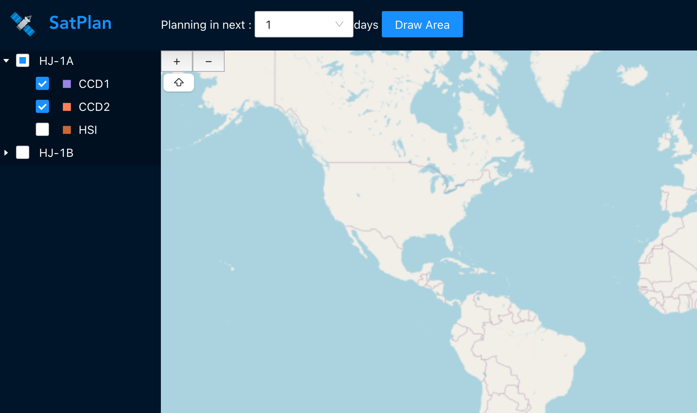
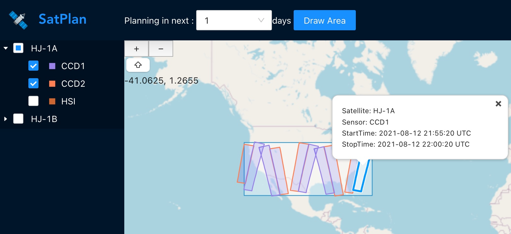
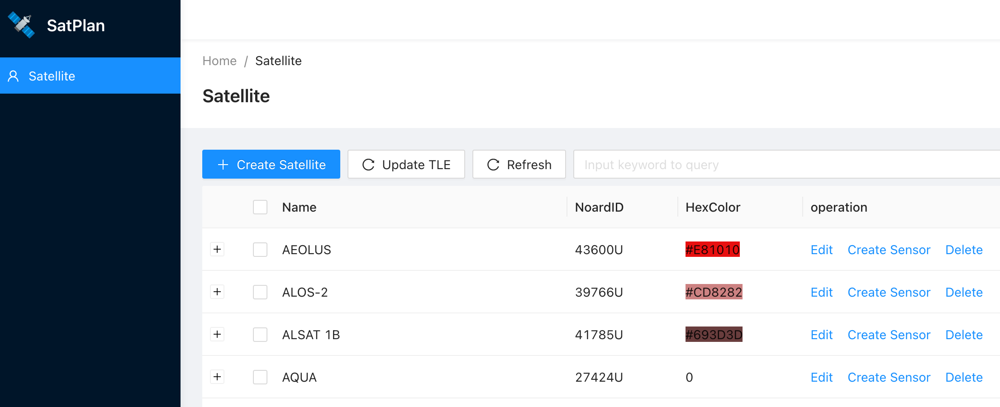
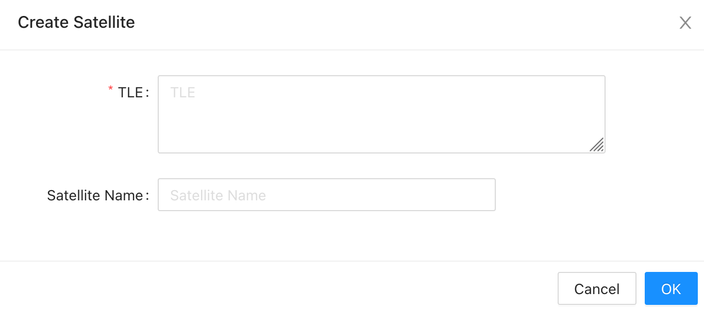

## About satplan
Satplan is a mission planning tool for remote sensing satellites, user could get the sensor paths information of the interest area in the next few days.

Here is a demo site: https://satplan.fogsea.ga

### Key features
* Automatic calculation of satellite tracks and sensor paths, where the satellite tracks calculation is based on SGP4
* Satellites and sensors management, users could custom satellites or sensors
* Mission planning, auto filter sensor paths by interest area and time span
* Display planning results on map, based on openlayers

## Usage
* Install [Docker](https://docs.docker.com/installation/#installation)

* Install [docker-compose](https://docs.docker.com/compose/install/)

Create docker-compose.yml as below.
```yml
version: "3"
services:
  satplan:
    image: figwh/satplan:latest
    container_name: satplan
    environment:
      - BASE_URL=http://localhost:8080/
      - DATA_FOLDER=/app/data
    volumes:
      - ./data:/app/data
    ports:
      - 80:80
    restart: unless-stopped
```

Run with docker-compose:
```bash
docker-compose up -d
```
Satplan will run on http://localhost

### Mission Planning
After container started, browse http://localhost and will get the interface. The default satellites contains HJ-1A and HJ-1B, users could add satellites or sensors on demand.


Check sensors, then click "Draw Area" button and draw a rectangle on map, and you will see the sensor paths across the rectangle area, click the path will show its information.


Users could also check or uncheck sensors, change the planning time, the result will change on map automatically.

### Satellite and sensor management
Browse http://localhost/admin, input default credentials(username: test@test.com, password: 12345678) and it will change to satellite and sensor management page. 


New satellite need TLE, which is from [NOARD](http://www.celestrak.com/NORAD/elements/resource.txt), it will update at 00:00 am UTC automatically.


## Structure
Satplan consists of 4 parts: calpath, satplan-server, satplan-web, satplan-pkg.

### database
Satplan use sqlite to keep it smart, but other databases such as mysql could also be supported.

### calpath
For calculating satellite tracks and sensor paths, written in C++, the tracks calculation is implemented by [orbittools](http://www.zeptomoby.com/satellites/), which is from Michael F. Henry.

### satplan-server
The backend, developed in Go, provide APIs for satplan-web.

### satplan-web
The frontend, developed in typescript and react, antd pro is used as web framework, openlayers is used to display world map and planning results.

### satplan-pkg
For packaging, contains Dockerfile, github action and documents.

